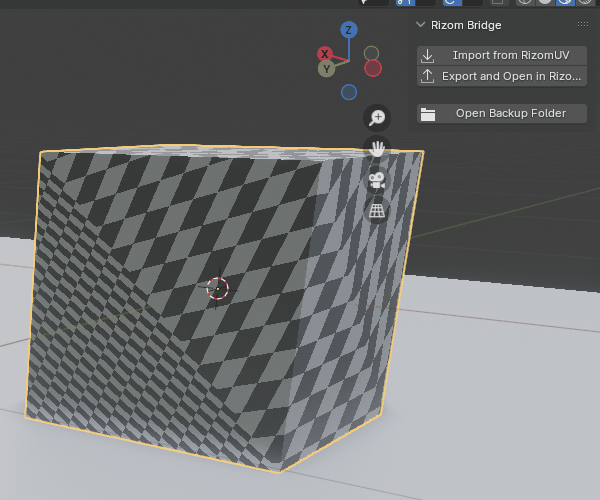

# Rizom Bridge

A small Blender add-on to import/export an OBJ file between Blender and RizomUV.
<p>

</p>
## Features

- **Add-on Preferences panel** (Edit > Preferences > Add-ons > Rizom Bridge) to set:
  - the `.obj` path used for import/export by default C:\BlenderToRizom\
  - the `RizomUV.exe` path
- **config.xml support** — load your paths from `config.xml`, or save your current
  preferences back out to it.
- **Sidebar panel** in the 3D Viewport (press `N`, look for the "Rizom" tab) with
  one-click Import / Export buttons.
  You can also setup custom shortcut for Import/Export from to Rizom.
- **Backup** previous Import/Export setting via **add-on prefences panel** to prevent accident

## Install

1. Download the rizom_bridge_vxx.zip, or zip the rizom_bridge folder
2. In Blender: Edit > Preferences > Add-ons > Install...
3. Select the zip file, then enable "Rizom Bridge - Import/Export to RizomUV" in
   the list.
4. Open the add-on's preferences (click the arrow next to its name) and set:
   - **OBJ Path** if you want custom path
   - **RizomUV Executable**
5. (Optional) Click **Save to config.xml** to persist these to `config.xml` next
   to the add-on files, or **Load from config.xml** to pull in an existing one.

## Usage

Open the 3D Viewport sidebar (`N` key) and select the **Rizom** tab:

- **On BLENDER** **Export and Open in RizomUV** — exports the selected object to that OBJ path
  and launches RizomUV with it.
- **ON RIZOM** Do your UV job and save your modification on the same file by just hitting save or **CTRL+S**.
- **ON BLENDER** **Import from RizomUV** — imports the OBJ path set in preferences. Be aware that it don't delete existing object in the scene so you may have two object in the same position, 

## Troubleshot
- In case of new export without importing latest rizom UV work you can use the backup button to find and recover previous job 

Both operators are also available via the operator search menu (`F3`) under
their respective names. And you can setup keyboard shortcut for both of them.

- I am open to modification and issue correction, tested it only on my own configuration Windows 10 - Blender 4.0

## config.xml format

```xml
<config>
    <paths>
        <obj_path>C:\path\to\ExportFile.obj</obj_path>
        <rizomuv_exe>C:\Program Files\Rizom Lab\RizomUV xxxx\rizomuv.exe</rizomuv_exe>
    </paths>
</config>
```

Note: `config.xml` is only read/written explicitly via the preferences panel
buttons (or automatically once, the first time the add-on is enabled, if the
preference fields are still empty). Editing the XML by hand and clicking
**Load from config.xml** afterward is the fastest way to bulk-update paths.

## Updates

- Added config.xml and preferences paths, backup option
